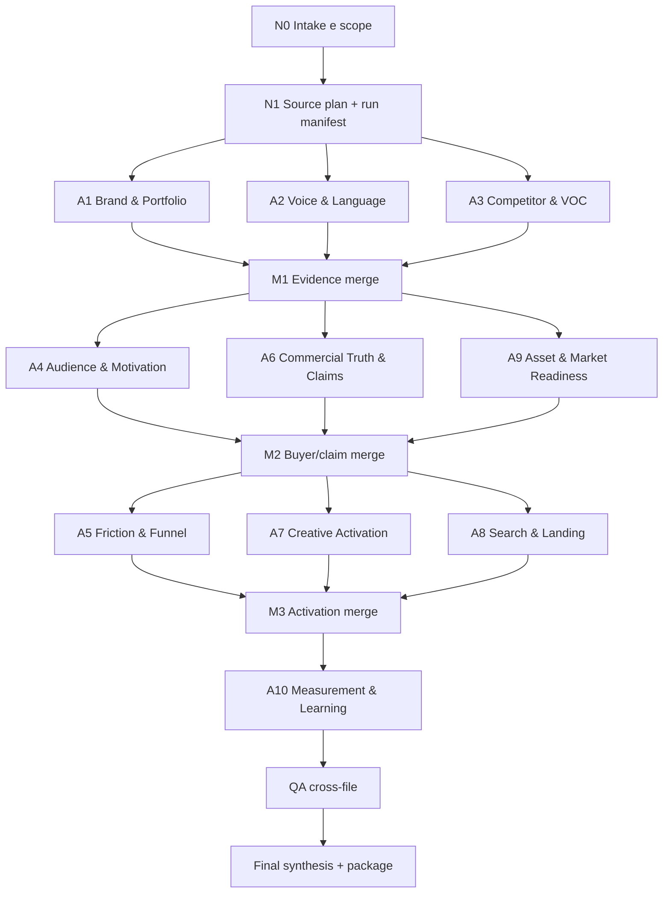

# Architettura multi-agent — `loop-agentic-kb`

## Scopo

Generare una knowledge base di brand riutilizzabile da agenti di strategia, ADV, creative, Google Ads, CRO e localizzazione. Il sistema deve produrre sia conoscenza descrittiva sia contratti operativi, senza trasformare ipotesi in fatti o dati pubblici in autorizzazioni pubblicitarie.

L'architettura evolve l'Onboarding 4.0 esistente: conserva evidence-first, checkpoint, fallback e sintesi finale, ma sostituisce la pipeline quasi lineare con un DAG a ondate, staging isolato e merge governato.

## Principi di orchestrazione

1. L'orchestratore è l'unico owner della cartella finale e del registro fonti canonico.
2. Gli specialisti scrivono solo in cartelle di staging assegnate; nessun file finale è condiviso in scrittura.
3. Il parallelismo è usato solo tra task senza dipendenze informative forti.
4. Ogni output porta fatti, inferenze, ipotesi, fonti, limiti e gap in forma strutturata.
5. Un campo mancante resta `unknown` o `not_observed`; non viene completato con plausibilità.
6. Ogni modulo usa il vocabolario canonico `evidence`, `inference`, `hypothesis`, `missing`, `blocked`.
7. “Campaign-ready” è uno stato verificabile, non una formula editoriale.
8. Se i sub-agent non sono disponibili, lo stesso DAG viene eseguito in sequenza dall'orchestratore.
9. Ogni output specialistico deve essere una vista autonoma completa, non un frammento che dipende dalla memoria della chat.
10. Completezza analitica e readiness di attivazione sono gate separati.

## Deliverable canonici

```text
00-agent-manifest.md
01-knowledge-base.md
02-product-message-map.md
03-competitors.md
04-personas.md
05-psychographics.md
06-pain-points.md
07-reviews-voc.md
08-brand-voice.md
09-tone-of-voice.md
10-lexicon.md
11-product-offer-registry.yaml
12-claims-proof-library.yaml
13-funnel-awareness-matrix.yaml
14-creative-strategy-library.yaml
15-meta-ads-brief.yaml
16-google-ads-playbook.md
17-landing-page-map.yaml
18-asset-library.yaml
19-market-packs/<market>.md
20-measurement-framework.yaml
21-experiment-memory.yaml
strategic-summary.md
sources.yaml
evidence-ledger.yaml
assumptions-and-gaps.yaml
context-pack.yaml
brand-database.yaml
review-checklist.yaml
qa-report.yaml
```

Il formato Markdown serve alla lettura umana; YAML serve al consumo da parte di altri agenti. Se un modulo non è applicabile, il file viene comunque creato con `status: not_applicable` e motivazione.

`brand-database.yaml` indicizza autorità, entità, moduli, versioni e freshness. I moduli includono viste autonome derivate con `generated_from`; non diventano autorità concorrenti.

## Ruoli

### Orchestrator / Evidence Controller

- raccoglie brief, scope, mercati, URL e materiali interni;
- crea il run manifest e assegna gli identificatori;
- decide profondità, moduli condizionali e parallelizzazione;
- normalizza le fonti e risolve conflitti;
- esegue i gate di qualità;
- compone cartella finale, strategic summary e governance;
- non delega la lettura delle istruzioni della skill.

### A1 — Brand & Portfolio Analyst

Produce identità, offerta, customer journey, famiglie prodotto, Product Message Map e prima versione del Product & Offer Registry. Usa prima le fonti ufficiali e segnala i campi commerciali non pubblici.

### A2 — Voice & Language Analyst

Costruisce corpus, Brand Voice, Tone of Voice e lessico. Separa campioni pubblici osservati, esempi inferiti e formulazioni approvate. Non usa la VOC come voce del brand.

### A3 — Market, Competitor & VOC Analyst

Analizza competitor diretti/adiacenti/sostitutivi e recensioni del brand/prodotto/retailer. Mantiene separati i corpus, descrive bias e non generalizza campioni auto-selezionati.

### A4 — Audience & Motivation Analyst

Genera personas funzionali, jobs-to-be-done, psicografiche e tensioni. Non inventa demografia, quote, frequenze o comportamenti. Dipende dagli output brand, portfolio e VOC.

### A5 — Friction & Funnel Analyst

Genera pain point, obiezioni, risk reducers e matrice funnel/awareness. Distingue problemi osservati da priorità commerciali ancora da validare.

### A6 — Commercial Truth & Claims Analyst

Normalizza Product & Offer Registry e Claims & Proof Library. Per ogni claim assegna fonte, perimetro, stato, mercato, prodotto, data di verifica e sicurezza d'uso pubblicitario.

### A7 — Creative Activation Analyst

Traduce messaggi, persone, pain e prove in angoli, hook, scene, format, CTA e requisiti asset. Non scrive annunci finali se mancano offerta, mercato o autorizzazioni.

### A8 — Search & Landing Analyst

Produce Google Ads Playbook e Landing Page Map. Se non sono disponibili dati query/volume, crea una tassonomia di intenti, non una previsione della domanda.

### A9 — Asset & Market Readiness Analyst

Inventaria asset forniti/osservati, diritti e gap; crea i market pack richiesti. Non presume diritti d'uso da una semplice presenza online.

### A10 — Measurement & Learning Analyst

Definisce KPI, eventi, naming, requisiti di tracciamento ed Experiment Memory. I benchmark non forniti restano vuoti.

### QA / Synthesis Reviewer

Può essere un sub-agent indipendente se c'è uno slot; altrimenti è una fase separata dell'orchestratore. Controlla coerenza cross-file, evidenza, claim, conflitti, readiness e completezza.

## DAG



## Piano a ondate con massimo quattro slot totali

L'orchestratore occupa uno slot; possono lavorare fino a tre specialisti contemporaneamente.

### Onda 0 — Intake e source plan

L'orchestratore:

- identifica brand, URL, mercati, lingua, obiettivo, canali e profondità;
- scopre file locali e materiali proprietari senza modificarli;
- crea `run-manifest.yaml`, `source-plan.yaml` e cartelle staging;
- assegna ID stabili a run, prodotti, fonti, claim, personas e test;
- definisce freshness richiesta per prezzi, stock, policy e advertising.

**Gate G0:** scope sufficiente, fonti/accessi noti, output path determinato. Classificare gli input mancanti con `blocking-input-protocol.md`. Procedere sui gap `non_blocking`; per un `run_blocking`, chiedere all'utente iniziando con `Mi serve X`; per un `branch_blocking`, completare i rami indipendenti e chiedere prima di entrare nel ramo bloccato.

Per una KB dichiarata completa, impostare `depth: deep`. Una riduzione a `lean` o un campione di prodotti/recensioni/competitor richiede motivazione nel manifest e impedisce il passaggio automatico dei moduli coinvolti.

### Onda 1 — Foundation parallela

Eseguire in parallelo A1, A2 e A3. Ogni agente riceve lo stesso `run-manifest`, ma solo le fonti e gli output richiesti dal proprio contratto.

**Output staging:**

- `staging/a1-brand-portfolio/`
- `staging/a2-voice-language/`
- `staging/a3-competition-voc/`

**Merge M1:** l'orchestratore unisce i ledger di evidenza, deduplica URL, verifica date e assegna la fonte canonica. Non sintetizza ancora personas o messaggi di campagna.

**Gate G1:** nessuna affermazione core priva di source ID; recensioni e voice sample hanno corpus e limiti; prezzi/stock hanno data.

### Onda 2 — Modellazione parallela

Eseguire in parallelo:

- A4 su personas e psicografiche;
- A6 su product registry e claim governance;
- A9 su asset registry e market readiness.

A9 crea market pack solo per i mercati richiesti. Se non ci sono asset allegati, produce un registry di gap, non un inventario immaginario.

**Merge M2:** collegare `persona_id`, `product_id`, `claim_id`, `market_id` e `asset_id`. Le persone restano ipotesi finché non esiste evidenza cliente convergente.

**Gate G2:** ogni persona ha evidenze e confidence; ogni claim ha stato e perimetro; ogni campo business non pubblico è `unknown`.

In aggiunta, il Product Registry espone catalog coverage e la psicografia copre le coppie persona×famiglia prioritarie con identity stakes, paure, trade-off, trigger, proof threshold e test. Pochi prodotti o tensioni generiche fanno fallire G2.

### Onda 3 — Activation parallela

Eseguire in parallelo:

- A5 su pain, obiezioni e funnel;
- A7 su creative strategy;
- A8 su Google Ads e landing map.

Gli agenti possono generare framework e backlog di test. Possono generare copy pubblicabile solo se il manifest include mercato, offerta, claim autorizzati e approvazione esplicita. Se manca un input necessario all'output richiesto, l'orchestratore usa il protocollo `Mi serve X`; il sub-agent registra il blocker ma non interroga direttamente l'utente salvo incarico esplicito.

**Merge M3:** verificare che tutti gli angoli e le query arrivino a una pagina, un prodotto, una persona, una prova e una fase funnel. Elementi non collegabili sono backlog, non raccomandazioni.

**Gate G3:** nessun hook usa claim bloccati; nessuna keyword è presentata come domanda validata senza dati; nessuna pagina inesistente è descritta come esistente.

In aggiunta, Meta e Google devono superare i contratti di profondità nei rispettivi playbook. Un brief composto da intake, architettura generica e blocker non supera G3.

### Onda 4 — Measurement e memoria

A10 consolida KPI, eventi, naming ed experiment schema a partire dalle decisioni dell'Onda 3.

**Gate G4:** ogni esperimento ha ipotesi, variabile, segmento, canale, metrica primaria, guardrail e criterio di lettura. Baseline e target sconosciuti restano null.

### Onda 5 — QA e delivery

Il reviewer controlla il pacchetto senza vedere le conclusioni attese. L'orchestratore corregge i difetti confermati e produce:

- manifest di tutti i file;
- strategic summary;
- context pack compatto;
- assumptions and gaps;
- governance e refresh schedule;
- status complessivo: `onboarding-ready`, `strategy-ready`, `creative-ready`, `campaign-ready` o `degraded`.

Il reviewer ripete il controllo con un file alla volta. Compila `module_assessments` in `qa-report.yaml`; nessun file con `standalone_usability: fail` può entrare nel package finale come completo.

## Regole di parallelizzazione

### Parallelizzare quando

- gli agenti leggono le stesse fonti ma producono ontologie diverse;
- ogni agente possiede file esclusivi;
- le dipendenze sono già materializzate in file con versione;
- il lavoro è abbastanza grande da compensare il costo del merge.

### Non parallelizzare quando

- un output definisce gli ID consumati dall'altro;
- l'agente a valle rischierebbe di inventare dati mancanti;
- due agenti devono modificare lo stesso file;
- il task è un semplice controllo o una singola trasformazione;
- le fonti chiave non sono ancora normalizzate.

### Regola anti-race

Ogni agente riceve `write_scope` esplicito. Può leggere tutto il run, ma scrive soltanto nella propria cartella staging. L'orchestratore usa `apply_patch` per promuovere gli output nel package finale.

## Merge e risoluzione conflitti

### Gerarchia delle fonti

La gerarchia dipende dal tipo di claim:

1. dati interni forniti dal cliente e datati, per performance/stock/economics;
2. fonte ufficiale corrente, per identità, specifiche, prezzi e policy;
3. documentazione normativa o di piattaforma, per compliance;
4. fonte indipendente affidabile, per mercato e verifica esterna;
5. retailer, per disponibilità e percezione di canale;
6. recensioni, forum e social, per esperienza e linguaggio, non per fatti universali.

Una recensione può essere la fonte primaria di una percezione, non della qualità media del brand.

### Algoritmo di merge

1. Normalizzare URL, percorso, lingua, mercato e data.
2. Deduplicare fonti senza perdere estrazioni diverse.
3. Unire fatti identici sotto un ID canonico.
4. Se i valori differiscono, applicare scope e temporalità prima della gerarchia.
5. Se il conflitto resta, conservare entrambe le versioni e creare `conflict_id`.
6. Bloccare claim pubblicitari derivati da conflitti non risolti.
7. Registrare la decisione in `merge-log.yaml`.

### Cross-validation obbligatoria

- product message ↔ specifiche/prove;
- competitor gap ↔ fonti competitor;
- persona ↔ brand/VOC/portfolio;
- pain ↔ VOC o evidenza comportamentale;
- Brand Voice ↔ corpus del brand;
- tone ↔ contesto e rischio;
- creative angle ↔ persona, pain, proof, funnel;
- Google intent ↔ landing page reale o proposta;
- KPI ↔ obiettivo e possibilità di tracking.

## Readiness model

| Dimensione | Condizioni minime |
|---|---|
| `framework_ready` | file, schema, ID e registri canonici validi |
| `onboarding_ready` | brand, portfolio, competitor, voice, VOC e fonti completi con caveat |
| `strategy_ready` | personas, pain e funnel collegati a evidenze e gap |
| `activation_ready` | mercato, prodotto/offerta, economics, landing, asset e tracking definiti |
| `publish_ready` | claim approvati, diritti, freshness e QA completati |

Ogni dimensione usa `pass|conditional|blocked|not_applicable` e include blocker e condizioni. Un brand può avere `strategy_ready: pass` e `activation_ready: blocked`.

## Failure modes e recovery

| Failure mode | Rilevazione | Recovery | Stato |
|---|---|---|---|
| URL bloccato/anti-bot | fetch fallito o contenuto vuoto | fonte ufficiale alternativa, sitemap, PDF, retailer; log del fallback | degraded solo sul modulo |
| fonte primaria assente | nessuna fonte ufficiale | fonti secondarie convergenti, label `unverified` | claim bloccato |
| corpus recensioni piccolo | sotto soglia o mono-piattaforma | analisi qualitativa con N e bias; niente frequenze universali | VOC preliminary |
| dati in conflitto | stesso campo, valori incompatibili | scope/data, fonte autorevole, conflict record | blocco locale |
| prezzo/stock dinamico | snapshot non recente | ricontrollo prima di uso commerciale | stale |
| sub-agent fallisce | timeout, output vuoto o schema errato | un retry mirato; poi esecuzione locale/sequenziale | nessuna omissione silenziosa |
| sub-agent indisponibili | nessuno slot/tool | eseguire DAG in sequenza | normale |
| file sovrascritto | write scope violato | scartare staging contaminato e rieseguire | critical QA |
| output prolisso/incoerente | schema o gate fallito | richiedere delta correttivo, non rigenerazione totale | retry |
| claim non tracciato | assenza di source/proof | declassare a ipotesi o rimuovere | blocked |
| demografia inventata | attributo senza dati | rimuovere; usare job/contesto | critical QA |
| keyword trattata come volume | nessun dato query/volume | rinominare `intent hypothesis` | degraded search |
| diritto asset ignoto | nessuna licenza/owner | `rights_status: unknown`, non usare in live | blocked asset |
| vincolo legale/compliance | claim o targeting ad alto rischio | fermare quel ramo e richiedere review competente | blocked |
| context overflow | troppe fonti/output | passare indici, ID e summary; leggere file puntuali | normale |

## Retry ed escalation

- massimo un retry automatico per output fuori schema o incompleto;
- il retry riceve solo errori di validazione e file originale, non la risposta desiderata;
- nessun retry per mancanza reale di dati: creare gap;
- escalation umana solo se una scelta non reversibile o materialmente diversa blocca il run;
- gli altri rami proseguono quando il blocco è locale.

## Gate finale

Il package è consegnabile solo se:

- tutti i file previsti esistono o dichiarano `not_applicable`;
- il 100% dei fatti commercialmente rilevanti ha source ID;
- inferenze e ipotesi sono etichettate;
- claim pubblicitari hanno stato, prova, scope e freshness;
- numeri e recensioni espongono campione, periodo e limite;
- voice, tone, lessico e VOC sono separati;
- non ci sono ID orfani o link interni rotti;
- gli unknown critici compaiono in `assumptions-and-gaps.yaml` come `INP-*`;
- readiness e usi vietati sono dichiarati nel manifest.
- ogni modulo dichiara coverage, include contesto autonomo e supera il test in isolamento;
- `brand-database.yaml` risolve univocamente l'autorità di ogni entità;
- nessun modulo usa un campione non dichiarato come sostituto dell'universo analizzato.
